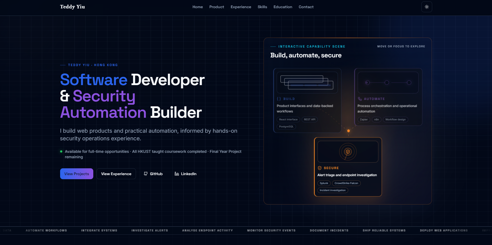
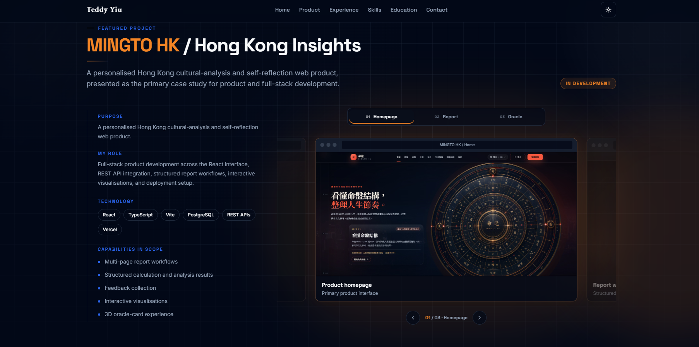
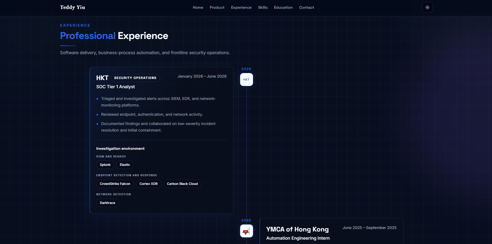

# Teddy Yiu — Developer Portfolio

Personal portfolio website presenting my software development background, technical projects, work experience, education, and current areas of interest.

## Live Website

[View the portfolio](https://teddyych.github.io/)

## Preview

### Home Page



### Selected Projects



### Experience and Skills



## About

I am a Computer Science student at HKUST with a Higher Diploma in Software Engineering with Distinction.

My current interests include:

- Backend and full-stack development
- Security automation and cybersecurity
- Applied AI and LLM-based applications
- Cloud and DevOps fundamentals

I also have previous experience in security operations and professional audit work, which has strengthened my approach to problem solving, documentation, risk awareness, and stakeholder communication.

## Portfolio Sections

The website provides an overview of:

- Professional introduction
- Technical skills
- Selected software projects
- Work experience
- Education and qualifications
- Contact and external profile links

## Technology Stack

### Frontend

- React
- TypeScript
- Vite
- React Router
- Tailwind CSS
- Radix UI components

### Application and Data

- TanStack React Query
- React Hook Form
- Zod
- Supabase
- Recharts

### Development Tools

- Git and GitHub
- ESLint
- GitHub Actions
- GitHub Pages

## Local Development

Clone the repository:

```bash
git clone https://github.com/TeddyYch/teddyych.github.io.git
cd teddyych.github.io
```

Install dependencies:

```bash
npm install
```

Start the development server:

```bash
npm run dev
```

Create a production build:

```bash
npm run build
```

Run lint checks:

```bash
npm run lint
```

Preview the production build locally:

```bash
npm run preview
```

## Project Structure

```text
teddyych.github.io/
├── public/              Static assets
├── src/                 React and TypeScript application source
├── dist/                Production build output
├── .github/workflows/   GitHub Actions deployment workflow
├── index.html           Application entry HTML
├── package.json         Dependencies and project scripts
└── vite.config.ts       Vite configuration
```

## Contact

- Portfolio: [teddyych.github.io](https://teddyych.github.io/)
- LinkedIn: [linkedin.com/in/teddy-yiu](https://www.linkedin.com/in/teddy-yiu/)
- GitHub: [github.com/TeddyYch](https://github.com/TeddyYch)

## Repository Note

This repository contains the source code and deployment files for my personal portfolio website. 
